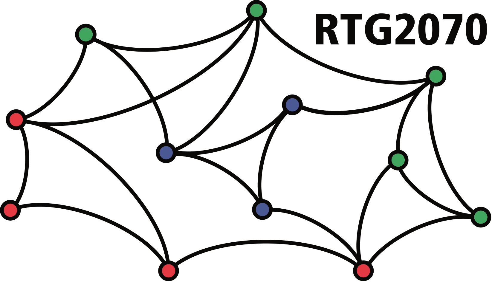

<!-- README.md is generated from README.Rmd. Please edit that file -->

```{r, eval=FALSE, echo=FALSE}
devtools::build_readme()
```


```{r, include = FALSE}
library(bamoso)
knitr::opts_chunk$set(
  collapse = TRUE,
  comment = "#>",
  fig.path = "man/figures/README-",
  out.width = "100%"
)
```

# bamoso
Bayesian modelling of animal social interactions


## Installation

You need [`cmdstanr`](https://mc-stan.org/cmdstanr/) in order to install and run `bamoso`. 
This in turn requires a working C++ toolchain first. 
Check out the [getting started-guide](https://mc-stan.org/cmdstanr/articles/cmdstanr.html) from `cmdstanr` to see how to get everything set up properly. 
Also [this document](https://mc-stan.org/docs/cmdstan-guide/cmdstan-installation.html#cpp-toolchain) might be helpful.

Then install `cmdstanr`.


```{r, eval=FALSE}
install.packages("cmdstanr", repos = c("https://mc-stan.org/r-packages/", getOption("repos")))
```

And you also need the `remotes` packages, which is easy to install from CRAN:

```{r, eval=FALSE}
install.packages("remotes")
```

Then check whether things are set up correctly:

```{r, eval=FALSE}
library(cmdstanr)
check_cmdstan_toolchain(fix = TRUE)
```

You may need to follow any instructions that the output of that call gives.
If you haven't used `cmdstanr` before, it's likely that you at least need to install `cmdstan` itself:

```{r, eval=FALSE}
cmdstanr::install_cmdstan()
```

If this gives positive feedback, install `bamoso`:

```{r, eval=FALSE}
library(remotes)
remotes::install_github("gobbios/bamoso", dependencies = TRUE, build_vignettes = FALSE)
```

If you want to install (recompile) the intro vignette, use:

```{r, eval=FALSE}
install.packages("tinytex")
library(remotes)
remotes::install_github("gobbios/bamoso", dependencies = TRUE, build_vignettes = TRUE)
```

This will take a little more time to finish, but if successful gives you access to the vignette:

```{r, eval=FALSE}
vignette("intro", package = "bamoso")
```

## Example

```{r groomdatasetplot, echo=FALSE, fig.width=8, fig.height=2.5, out.width="60%", fig.align='center', fig.cap="\\label{fig:syl_net}Example data set. Grooming frequencies on the left and dyadic observation hours on the right."}
par(mar = c(0, 2, 2, 0), family = "serif", cex = 0.7, mfrow = c(1, 2))
data(grooming)
sel <- c(1, 4, 6, 10, 12, 19)
EloSteepness:::plot_matrix(grooming$syl$groom[sel, sel])
EloSteepness:::plot_matrix(grooming$syl$obseff[sel, sel])
```

```{r, eval = FALSE}
library(bamoso)
```

```{r}
data("grooming")
groom_mat <- grooming$syl$groom
obseff_mat <- grooming$syl$obseff
```


```{r}
standat <- make_stan_data_from_matrices(mats = list(groom = groom_mat),
                                        behav_types = "count",
                                        obseff = list(obseff_mat))
```

```{r quick_start_model, include=FALSE}
res <- sociality_model(standat, parallel_chains = 4, 
                       adapt_delta = 0.9, seed = 2)
```

```{r, eval = FALSE}
res <- sociality_model(standat)
```


```{r}
summary(res)
```


```{r ppcheck, echo=2:5, fig.width=8, fig.height=2.5, out.width="80%", fig.align='center', fig.cap="\\label{fig:syl_net_pp}Posterior predictive checks for Barbary macaque grooming data. On the left: bars represent observed grooming frequencies. The circles represent the median frequencies predicted by the model and the vertical bars the 89\\% interval around these predictions. One the right: the histogram is the posterior distribution of the maximum number of grooming bouts predicted by the model across all posterior samples. The red line indicates the observed value in the data."}
par(family = "serif", mgp = c(1.5, 0.5, 0), mar = c(2.5, 2.5, 0.5, 0.5), mfrow = c(1, 2))
pp_model(res, xlab = "grooming bouts", ylab = "(predicted) frequency",
         xbreaks = 20)
pp_model_stat(res, stat = "max", xlab = "maximum number of grooming bouts",
              main = "")
```


```{r socplot, echo=2:5, fig.width=5, fig.height=2.1, out.width="50%", fig.align='center', fig.cap="\\label{fig:syl_net_soc}Posteriors for the two sociality components. Variation among dyads is larger than variation among individuals."}
par(family = "serif", mgp = c(1.5, 0.5, 0), mar = c(2.5, 2.5, 0.5, 0.5))
sociality_plot(res)
```

```{r ridgeplot, echo=2:5, fig.width=8, fig.height=2.9, out.width="80%", fig.align='center', fig.cap="\\label{fig:syl_net_ridge}Posteriors for the two sociality components. The affinity distributions on the right only reflect a subset of 10 dyads."}
par(family = "serif", mgp = c(1.5, 0.5, 0), mar = c(2.5, 2.5, 0.5, 0.5), mfrow = c(1, 2))
ridge_plot(res, greg = TRUE)
ridge_plot(res, greg = FALSE, sel_subset = 10:20, vert_exp = 15)
```


## Acknowledgments

This work was supported by Deutsche Forschungsgemeinschaft, Grant/Award Number: 254142454 / GRK 2070.

```{r, echo=FALSE, out.width="50%", fig.align='center'}

```
